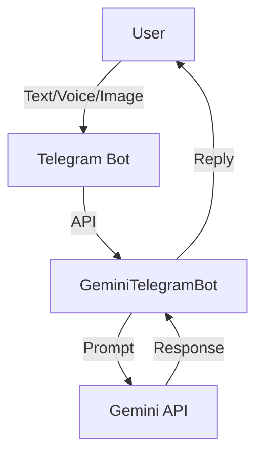

# GeminiTelegramBot

<p align="center">
  
  
  
  
</p>

---

## 🤖 GeminiTelegramBot
A modern, multimodal Telegram bot powered by Google Gemini AI. Supports text, voice, and image messages with intelligent, concise responses. Built for easy deployment and extensibility.

---

## ✨ Features
- **Text, Voice, and Image Support**: Handles text, voice (transcription + reply), and image (description) messages.
- **Gemini AI Integration**: Uses Google Gemini API for advanced, context-aware responses.
- **Multimodal Prompts**: Custom system prompts for each message type.
- **Robust Error Handling**: User-friendly feedback and detailed logging.
- **Easy Setup**: Simple environment configuration and requirements.
- **Extensible**: Modular codebase for future features.

---

## 🚀 Quickstart
```bash
git clone <your-repo-url>
cd GeminiTelegramBot
python3 -m venv .venv
# Activate your venv (see below)
pip install -U -r requirements.txt
cp .env.example .env  # Or create .env manually
python bot.py
```

---

## 🛠️ Environment Variables
Create a `.env` file in the project root:
```env
BOT_TOKEN="YOUR_TELEGRAM_BOT_TOKEN"
GEMINI_API_KEY="YOUR_GEMINI_API_KEY"
MODEL_NAME="gemini-2.5-flash-preview-05-20"
```

---

## 🖼️ Architecture


---

## 📦 Project Structure
```
GeminiTelegramBot/
├── bot.py              # Main bot logic
├── requirements.txt    # Python dependencies
├── .env.example        # Example environment config
├── memory-bank/        # Project documentation & context
├── docs/               # Setup, quickstart, reference
└── ...
```

---

## 💡 Usage
- Start a chat with your bot on Telegram.
- Send text, voice, or image messages.
- Use `/start` and `/help` for guidance.

---

## 🤝 Contributing
1. Fork the repo and create your branch.
2. Make your changes and add tests if needed.
3. Submit a pull request!

---

## 👤 Author
**iknowl97**

---

## 📄 License
MIT 